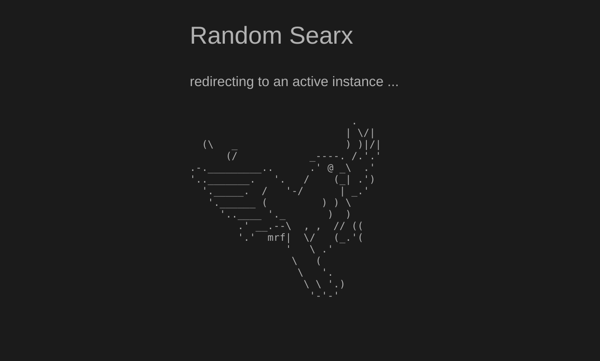

# random-searx

Browser page that picks a healthy public SearXNG instance and redirects to it. Live at https://stringtalk.org/searx

## How it works

Vanilla ESM in `src/searx-redirect.js` (no build, no deps). On load it:

1. Fetches `https://searx.space/data/instances.json` with an 8s timeout (`AbortSignal.timeout`).
2. Keeps instances that are **HTTPS**, HTTP **status 200**, **uptimeDay ≥ 99%**, and **Google engine error-rate &lt; 1%**.
3. Ranks that set by reliability (`uptimeDay + uptimeWeek/10`), takes the **top 5**, and `location.replace`s a random one (so the redirector is not in back-button history).
4. On failure, appends `ErrorName: message` to `#display` and logs to the console.

There is no “grade B or higher” filter — that README was stale.

## Install

Copy `src/index.html` and `src/searx-redirect.js` to a static directory (e.g. `stringtalk.org/searx/`).

## Legacy

`nodejs/` is the original Node script (axios + user-agents). It is **not** current. Leave it in the tree; do not treat it as the live redirector.
